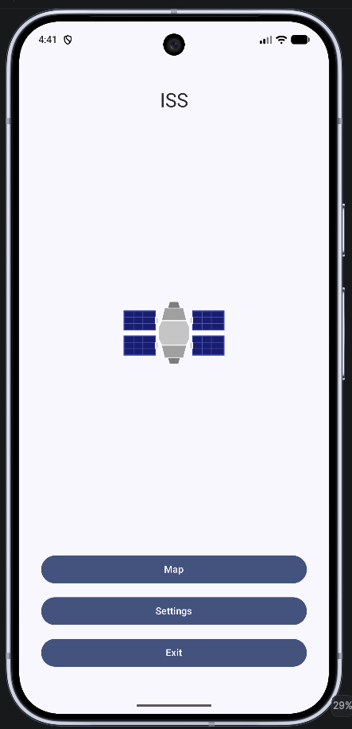
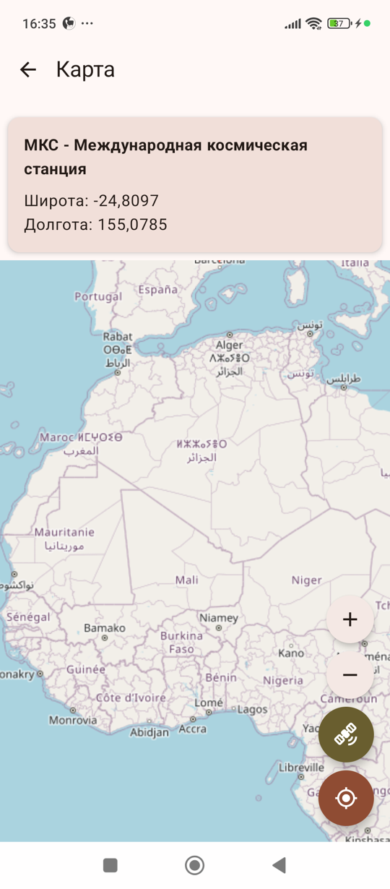
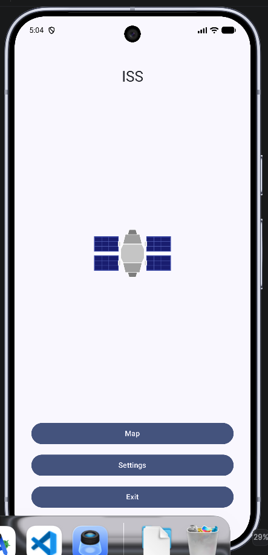

The position of the international space station on the map (OSM) http://api.open-notify.org/iss-now.json, Made using Visual Studio Code + mimo AI.
MiMo is a family of large language models (LLM) from Xiaomi. Designed for tasks that require logical reasoning, mathematical calculations, and code generation.

Положение международной космической станции на карте (OSM) http://api.open-notify.org/iss-now.json, выполненное с использованием Visual Studio Code + mimo AI.
MiMo — семейство больших языковых моделей (LLM) от компании Xiaomi. Разработано для задач, требующих логических рассуждений, математических вычислений и генерации кода. 

Die Position der internationalen Raumstation auf der Karte (OSM) http://api.open-notify.org/iss-now.json , Erstellt mit Visual Studio Code + mimo AI.
MiMo ist eine Familie von großen Sprachmodellen (LLM) von Xiaomi. Entwickelt für Aufgaben, die logisches Denken, mathematische Berechnungen und Codegenerierung erfordern.

