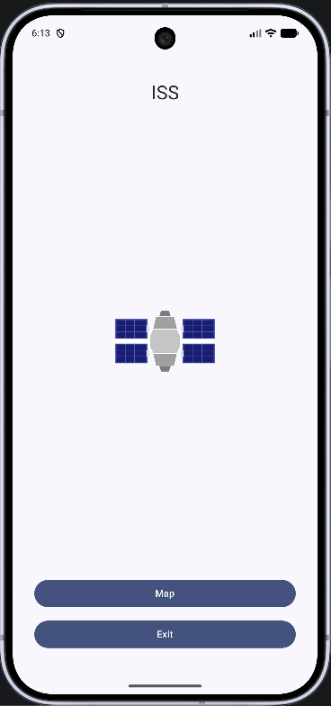
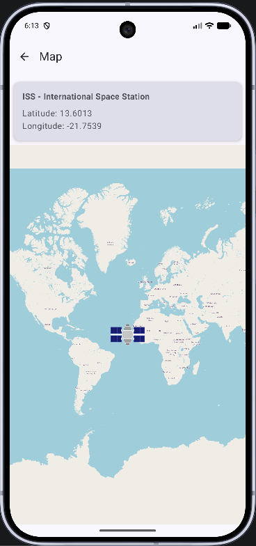

The position of the international space station on the map (OSM) http://api.open-notify.org/iss-now.json, Made using Visual Studio Code + mimo AI.

Положение международной космической станции на карте (OSM) http://api.open-notify.org/iss-now.json, выполненное с использованием Visual Studio Code + mimo AI.

Die Position der internationalen Raumstation auf der Karte (OSM) http://api.open-notify.org/iss-now.json , Erstellt mit Visual Studio Code + mimo AI.

