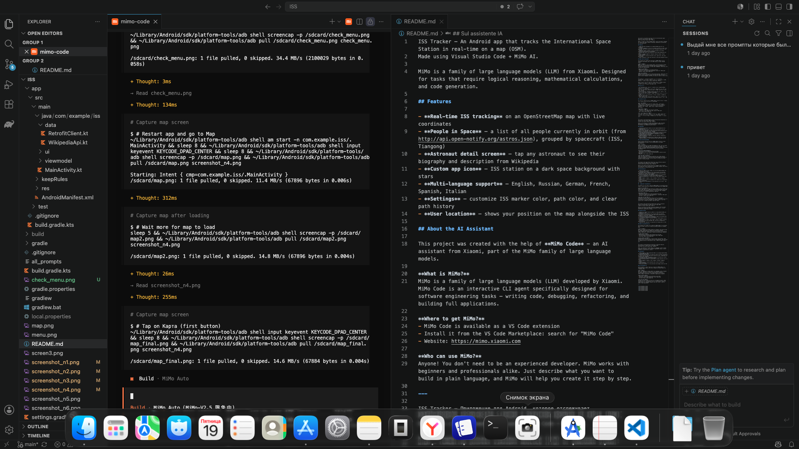

ISS Tracker — An Android app that tracks the International Space Station in real-time on a map (OSM).
Made using Visual Studio Code + MiMo AI.

MiMo is a family of large language models (LLM) from Xiaomi. Designed for tasks that require logical reasoning, mathematical calculations, and code generation.

## Features

- **Real-time ISS tracking** on an OpenStreetMap map with live coordinates
- **People in Space** — a list of all people currently in orbit (from http://api.open-notify.org/astros.json), grouped by spacecraft (ISS, Tiangong)
- **Astronaut detail screen** — tap any astronaut to see their biography and description from Wikipedia
- **Custom app icon** — ISS station on a dark space background with stars
- **Multi-language support** — English, Russian, German, French, Spanish, Italian
- **Settings** — customize ISS marker color, path color, and clear path history
- **User location** — shows your position on the map alongside the ISS

## About the AI Assistant

This project was created with the help of **MiMo Code** — an AI assistant from Xiaomi, part of the MiMo family of large language models.

**What is MiMo?**
MiMo is a family of large language models (LLM) developed by Xiaomi. MiMo Code is an interactive CLI agent specifically designed for software engineering tasks — writing code, debugging, refactoring, and building full applications.

**Where to get MiMo?**
- MiMo Code is available as a VS Code extension
- Install it from the VS Code Marketplace: search for "MiMo Code"
- Website: https://mimo.xiaomi.com

**Who can use MiMo?**
Anyone! You don't need to be an experienced developer. MiMo works with beginners and professionals alike. Just describe what you want to build in plain language, and MiMo will help you create it step by step.

---

ISS Tracker — Приложение для Android, которое отслеживает Международную космическую станцию в реальном времени на карте (OSM).
Выполнено с использованием Visual Studio Code + MiMo AI.

MiMo — семейство больших языковых моделей (LLM) от компании Xiaomi. Разработано для задач, требующих логических рассуждений, математических вычислений и генерации кода.

## Возможности

- **Отслеживание МКС в реальном времени** на карте OpenStreetMap с актуальными координатами
- **Люди в космосе** — список всех людей, находящихся на орбите (из http://api.open-notify.org/astros.json), сгруппированных по кораблям (МКС, Тяньгун)
- **Экран данных астронавта** — нажмите на любого астронавта, чтобы увидеть его биографию и описание из Википедии
- **Пользовательская иконка** — станция МКС на фоне тёмного космоса со звёздами
- **Мультиязычность** — английский, русский, немецкий, французский, испанский, итальянский
- **Настройки** — цвет маркера МКС, цвет траектории, очистка истории
- **Местоположение пользователя** — ваша позиция на карте рядом с МКС

## Об AI-ассистенте

Этот проект создан при помощи **MiMo Code** — AI-ассистента от Xiaomi, части семейства больших языковых моделей MiMo.

**Что такое MiMo?**
MiMo — семейство больших языковых моделей (LLM), разработанное компанией Xiaomi. MiMo Code — интерактивный CLI-агент, специально предназначенный для задач разработки программного обеспечения — написания кода, отладки, рефакторинга и создания полноценных приложений.

**Где получить MiMo?**
- MiMo Code доступен как расширение для VS Code
- Установите из маркетплейса VS Code: найдите "MiMo Code"
- Сайт: https://mimo.xiaomi.com

**Кто может использовать MiMo?**
Любой! Вам не нужно быть опытным разработчиком. MiMo работает как с новичками, так и с профессионалами. Просто описывайте на простом языке, что вы хотите создать, и MiMo поможет вам сделать это шаг за шагом.

---

ISS Tracker — Eine Android-App, die die Internationale Raumstation in Echtzeit auf einer Karte (OSM) verfolgt.
Erstellt mit Visual Studio Code + MiMo AI.

MiMo ist eine Familie von großen Sprachmodellen (LLM) von Xiaomi. Entwickelt für Aufgaben, die logisches Denken, mathematische Berechnungen und Codegenerierung erfordern.

## Funktionen

- **Echtzeit-Tracking der ISS** auf einer OpenStreetMap-Karte mit Live-Koordinaten
- **Menschen im Weltraum** — eine Liste aller Personen, die sich gerade im Orbit befinden (von http://api.open-notify.org/astros.json), gruppiert nach Raumschiff (ISS, Tiangong)
- **Astronaut-Detailbildschirm** — tippen Sie auf einen Astronauten, um seine Biografie und Beschreibung aus Wikipedia zu sehen
- **Benutzerdefiniertes App-Symbol** — ISS-Station auf dunklem Weltraumhintergrund mit Sternen
- **Mehrsprachigkeit** — Englisch, Russisch, Deutsch, Französisch, Spanisch, Italienisch
- **Einstellungen** — ISS-Markerfarbe, Wegfarbe, Wegverlauf löschen
- **Benutzerstandort** — Ihre Position auf der Karte neben der ISS

## Über den KI-Assistenten

Dieses Projekt wurde mit Hilfe von **MiMo Code** erstellt — einem KI-Assistenten von Xiaomi, Teil der MiMo-Familie von großen Sprachmodellen.

**Was ist MiMo?**
MiMo ist eine Familie von großen Sprachmodellen (LLM), die von Xiaomi entwickelt wurde. MiMo Code ist ein interaktiver CLI-Agent, der speziell für Softwareentwicklungsaufgaben entwickelt wurde — Schreiben von Code, Debugging, Refactoring und Erstellung vollständiger Anwendungen.

**Wo kann man MiMo bekommen?**
- MiMo Code ist als VS Code-Erweiterung verfügbar
- Installieren Sie es aus dem VS Code Marketplace: suchen Sie nach "MiMo Code"
- Webseite: https://mimo.xiaomi.com

**Wer kann MiMo verwenden?**
Jeder! Sie müssen kein erfahrener Entwickler sein. MiMo arbeitet sowohl mit Anfängern als auch mit Profis. Beschreiben Sie einfach in einfacher Sprache, was Sie erstellen möchten, und MiMo wird Ihnen Schritt für Schritt helfen.

---

ISS Tracker — Une application Android qui suit la Station spatiale internationale en temps réel sur une carte (OSM).
Réalisée avec Visual Studio Code + MiMo AI.

MiMo est une famille de grands modèles de langage (LLM) de Xiaomi. Conçu pour des tâches nécessitant un raisonnement logique, des calculs mathématiques et la génération de code.

## Fonctionnalités

- **Suivi en temps réel de l'ISS** sur une carte OpenStreetMap avec des coordonnées en direct
- **Personnes dans l'espace** — une liste de toutes les personnes actuellement en orbite (de http://api.open-notify.org/astros.json), regroupées par vaisseau (ISS, Tiangong)
- **Écran de détails de l'astronaute** — appuyez sur un astronaute pour voir sa biographie et sa description depuis Wikipédia
- **Icône personnalisée** — station ISS sur fond spatial sombre avec étoiles
- **Multilingue** — anglais, russe, allemand, français, espagnol, italien
- **Paramètres** — couleur du marqueur ISS, couleur de la trajectoire, effacer l'historique
- **Position de l'utilisateur** — votre position sur la carte à côté de l'ISS

## À propos de l'assistant IA

Ce projet a été créé avec l'aide de **MiMo Code** — un assistant IA de Xiaomi, faisant partie de la famille de grands modèles de langage MiMo.

**Qu'est-ce que MiMo ?**
MiMo est une famille de grands modèles de langage (LLM) développée par Xiaomi. MiMo Code est un agent CLI interactif spécialement conçu pour les tâches de développement logiciel — écriture de code, débogage, refactoring et création d'applications complètes.

**Où obtenir MiMo ?**
- MiMo Code est disponible en tant qu'extension VS Code
- Installez-le depuis le VS Code Marketplace : recherchez "MiMo Code"
- Site web : https://mimo.xiaomi.com

**Qui peut utiliser MiMo ?**
N'importe qui ! Vous n'avez pas besoin d'être un développeur expérimenté. MiMo fonctionne aussi bien avec les débutants qu'avec les professionnels. Décrivez simplement en langage simple ce que vous voulez créer, et MiMo vous aidera étape par étape.

---

ISS Tracker — Una aplicación de Android que rastrea la Estación Espacial Internacional en tiempo real en un mapa (OSM).
Creada con Visual Studio Code + MiMo AI.

MiMo es una familia de grandes modelos de lenguaje (LLM) de Xiaomi. Diseñada para tareas que requieren razonamiento lógico, cálculos matemáticos y generación de código.

## Características

- **Rastreo en tiempo real de la ISS** en un mapa OpenStreetMap con coordenadas en vivo
- **Personas en el espacio** — una lista de todas las personas actualmente en órbita (de http://api.open-notify.org/astros.json), agrupadas por nave (ISS, Tiangong)
- **Pantalla de detalles del astronauta** — toque un astronauta para ver su biografía y descripción de Wikipedia
- **Icono personalizado** — estación ISS sobre fondo espacial oscuro con estrellas
- **Multilingüe** — inglés, ruso, alemán, francés, español, italiano
- **Ajustes** — color del marcador ISS, color de la trayectoria, borrar historial
- **Ubicación del usuario** — su posición en el mapa junto a la ISS

## Sobre el asistente de IA

Este proyecto fue creado con la ayuda de **MiMo Code** — un asistente de IA de Xiaomi, parte de la familia de grandes modelos de lenguaje MiMo.

**¿Qué es MiMo?**
MiMo es una familia de grandes modelos de lenguaje (LLM) desarrollada por Xiaomi. MiMo Code es un agente CLI interactivo diseñado específicamente para tareas de desarrollo de software — escritura de código, depuración, refactoring y creación de aplicaciones completas.

**¿Dónde obtener MiMo?**
- MiMo Code está disponible como extensión para VS Code
- Instálalo desde el VS Code Marketplace: busca "MiMo Code"
- Sitio web: https://mimo.xiaomi.com

**¿Quién puede usar MiMo?**
¡Cualquiera! No necesitas ser un desarrollador experimentado. MiMo funciona tanto con principiantes como con profesionales. Solo describe en lenguaje sencillo lo que quieres crear, y MiMo te ayudará paso a paso.

---

ISS Tracker — Un'app Android che monitora la Stazione Spaziale Internazionale in tempo reale su una mappa (OSM).
Realizzata con Visual Studio Code + MiMo AI.

MiMo è una famiglia di grandi modelli di linguaggio (LLM) di Xiaomi. Progettata per attività che richiedono ragionamento logico, calcoli matematici e generazione di codice.

## Funzionalità

- **Monitoraggio in tempo reale dell'ISS** su una mappa OpenStreetMap con coordinate aggiornate
- **Persone nello spazio** — un elenco di tutte le persone attualmente in orbita (da http://api.open-notify.org/astros.json), raggruppate per navicella (ISS, Tiangong)
- **Schermata dettagli astronauta** — tocca un astronauta per vedere la sua biografia e descrizione da Wikipedia
- **Icona personalizzata** — stazione ISS su sfondo spaziale scuro con stelle
- **Multilingue** — inglese, russo, tedesco, francese, spagnolo, italiano
- **Impostazioni** — colore marcatore ISS, colore traiettoria, cancella cronologia
- **Posizione utente** — la tua posizione sulla mappa accanto all'ISS

## Sul assistente IA

Questo progetto è stato creato con l'aiuto di **MiMo Code** — un assistente IA di Xiaomi, parte della famiglia di grandi modelli di linguaggio MiMo.

**Cos'è MiMo?**
MiMo è una famiglia di grandi modelli di linguaggio (LLM) sviluppata da Xiaomi. MiMo Code è un agente CLI interattivo progettato specificamente per attività di sviluppo software — scrittura di codice, debug, refactoring e creazione di applicazioni complete.

**Dove ottenere MiMo?**
- MiMo Code è disponibile come estensione per VS Code
- Installalo dal VS Code Marketplace: cerca "MiMo Code"
- Sito web: https://mimo.xiaomi.com

**Chi può usare MiMo?**
Chiunque! Non hai bisogno di essere uno sviluppatore esperto. MiMo funziona sia con i principianti che con i professionisti. Descrivi semplicemente in linguaggio semplice cosa vuoi creare, e MiMo ti aiuterà passo dopo passo.

---

